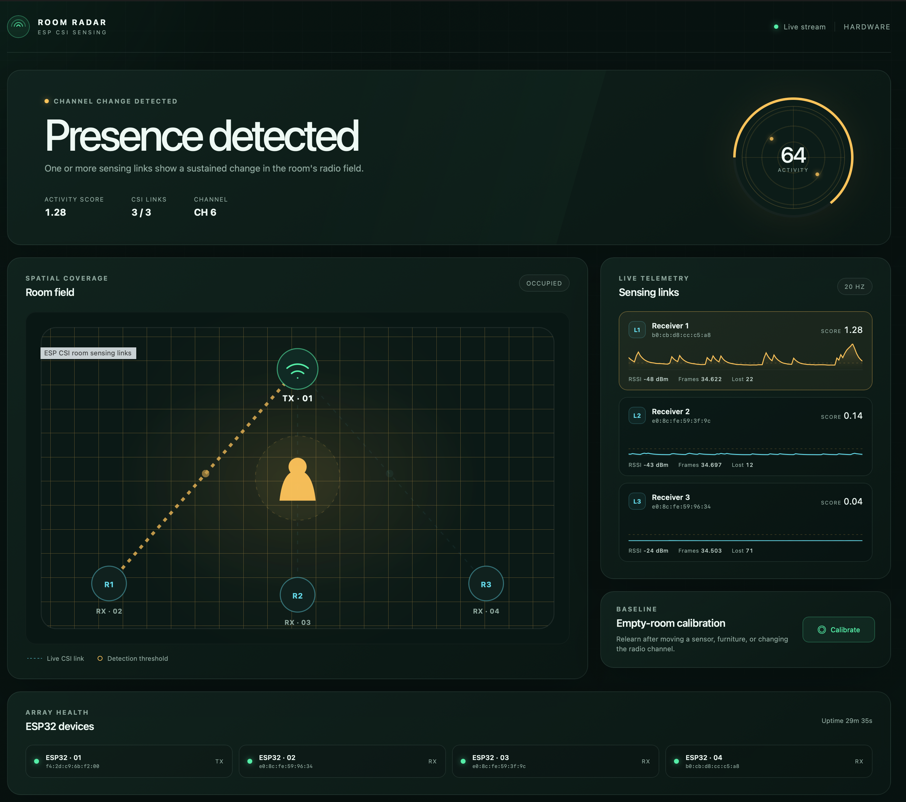

# ESP CSI room radar



A four-device room sensing demo that detects changes caused by people without
using a camera or microphone. One ESP32 broadcasts fixed-rate ESP-NOW probes;
three ESP32 receivers collect channel state information (CSI) and stream it over
Wi-Fi to a Linux server. The server calibrates an empty-room radio fingerprint,
detects sustained changes across the three links, and serves a live web
visualization.

```text
                       ESP-NOW probes, Wi-Fi AP channel
                                  ┌────────┐
                                  │ ESP32  │
                                  │ TX · 1 │
                                  └───┬────┘
                         ┌────────────┼────────────┐
                         ▼            ▼            ▼
                    ┌────────┐   ┌────────┐   ┌────────┐
                    │ ESP32  │   │ ESP32  │   │ ESP32  │
                    │ RX · 2 │   │ RX · 3 │   │ RX · 4 │
                    └───┬────┘   └───┬────┘   └───┬────┘
                        └──── WebSockets over Wi-Fi ─┘
                                      │
                              detector + web UI
```

All boards use the same Zig firmware and need only power after flashing. Each
board maps its factory Wi-Fi MAC to a fixed device name and role, joins the
configured access point, and connects to the server without USB control.

## Hardware

The checked hardware on `thekorn-server-2` is four homogeneous
ESP32-D0WD-V3 revision 3.1 devices with 4 MB flash and CP2102 USB-UART bridges:

| Device and DHCP hostname | Role | Factory MAC |
| --- | --- | --- |
| `esp32-1` | Transmitter | `f4:2d:c9:6b:f2:00` |
| `esp32-2` | Receiver 1 | `e0:8c:fe:59:96:34` |
| `esp32-3` | Receiver 2 | `e0:8c:fe:59:3f:9c` |
| `esp32-4` | Receiver 3 | `b0:cb:d8:cc:c5:a8` |

An image built from this repository deliberately supports only these four
boards. Firmware on an unknown factory MAC reports an error instead of choosing
an unsafe role.

For useful sensing, fix the four devices in place with the transmitter on one
side of the room and receivers spread around the opposite perimeter. Keep each
device at least one metre from the transmitter, use a consistent antenna
orientation, and keep USB cables from moving during calibration or detection.

## Development environment

[Nix flakes](https://nixos.org/) provide ESP-IDF, an Xtensa-capable Zig build,
[`zig-cov`](https://github.com/ericsssan/zcov), Node.js 26, pnpm, ZLS, nixd, and
Codebook. The Zig build fetches the pinned
[Zlinter](https://github.com/KurtWagner/zlinter) dependency. Because Zlinter
tracks upstream Zig while firmware needs the Xtensa fork, `zig-lint` invokes a
pinned upstream compiler and `zig` remains the firmware compiler. Install the
locked JavaScript dependencies used by the retained TypeScript reference
implementation and its tests after entering the development environment:

```sh
nix develop
pnpm install --frozen-lockfile
```

Before every commit, run the Zig and TypeScript lint checks, TypeScript type
check, and Oxfmt formatting check:

```sh
nix develop .#setup -c zig-lint build lint -- --max-warnings 0
nix develop .#setup -c pnpm run typecheck
nix develop .#setup -c pnpm run lint
nix develop .#setup -c pnpm run format:check
```

Other verification commands can also be run without entering a shell:

```sh
nix develop .#setup -c zig build host
nix develop .#setup -c zig build test
nix develop .#setup -c zig-cov test --include=main/ --include=host-zig/
nix develop .#setup -c pnpm test
nix develop .#setup -c idf.py build
nix develop .#setup -c codebook-lsp lint --unique -s .
```

`zig-cov test` instruments both the firmware and Zig host test suites and prints
line and block coverage. To create a self-contained source report, run:

```sh
nix develop .#setup -c zig-cov test \
  --include=main/ --include=host-zig/ \
  --format=html --output=coverage.html
```

The project follows the Zig/ESP-IDF boundary used by
[`thekorn/esp32-flappy-bird`](https://github.com/thekorn/esp32-flappy-bird):
Zig produces the application object, while ESP-IDF owns SDK integration,
linking, image generation, and flashing. `main/platform.c` is only a thin
SDK and FreeRTOS adapter; device identity, radio role behavior, probe
construction, and output framing live in `main/main.zig`.

## Run without hardware

The simulator exercises the detector, HTTP API, server-sent events, and every
visualization state. It alternates between an empty and changed radio field:

```sh
nix develop .#setup -c zig build run-host -- --simulate --bind 0.0.0.0
```

Open `http://localhost:8080` when running locally. The first empty-room
calibration takes about four seconds; simulated presence begins after eight
seconds.

Inside an Amp orb, `amp orb services ensure` starts the same simulator as a
supervised service and prints its authenticated portal URL.

## Build and flash autonomous firmware

Firmware configuration comes from four build-time environment variables:

- `ESP_NETWORK_NAME` — 2.4 GHz Wi-Fi network name;
- `ESP_NETWORK_SECRET` — WPA password, from 8 through 64 bytes;
- `ESP_SERVER_HOST` — DNS name or IPv4 address of the Zig server as reachable
  from the ESP network, without `http://`, `ws://`, or a path;
- `ESP_SERVER_PORT` — TCP port from 1 through 65535 on which the Zig server will
  listen.

No additional variable is needed for plain WebSockets on a trusted LAN. The
firmware connects to `ws://ESP_SERVER_HOST:ESP_SERVER_PORT/device`. TLS (`wss`),
server certificate trust, and device authentication are not implemented.

The four values are embedded in the firmware image and can be extracted by
someone who obtains the image or reads a board's flash. Keep build artifacts
private. Whenever any value changes, use a clean build so the Zig object cannot
be reused with old settings, then flash the same image to every board:

```sh
nix develop .#setup -c idf.py fullclean build
nix develop .#setup -c ./scripts/flash-all.sh
```

At boot, every board identifies itself from its factory MAC, sets `esp32-1`
through `esp32-4` as its DHCP hostname, joins the access point, and adopts the
access point's 2.4 GHz channel for ESP-NOW and CSI. `esp32-1` transmits probes at
20 Hz; the other three boards collect CSI. Every firmware record is mirrored to
UART for diagnostics and to the WebSocket whenever it is connected. The client
automatically reconnects, and periodic identity records let a restarted server
rediscover all boards.

## Run the server

Build the standalone Zig host binary with the dashboard assets embedded:

```sh
nix develop .#setup -c zig build host
```

The binary is installed at `zig-out/bin/esp-csi-radar-host`. The previous
Node/TypeScript host remains unchanged under `host/` as an executable reference
implementation and can be run with `pnpm run start:reference -- [options]`.

Socket mode is the normal detached deployment. It listens on all interfaces by
default, using `ESP_SERVER_PORT` when `--port` is omitted, and serves the device
WebSocket, dashboard, and HTTP API on that one port:

```sh
nix develop .#setup -c zig build run-host -- --socket
```

Ensure the server address in `ESP_SERVER_HOST` resolves from the ESP network and
that the selected TCP port is allowed through the server firewall. Start the
server before or after the boards; they will reconnect automatically.

Serial mode remains available as a passive diagnostic and fallback transport
when the boards are connected by USB. It does not provision or control them:

```sh
nix develop .#setup -c zig build run-host -- --serial \
  --ports /dev/esp32-1 /dev/esp32-2 /dev/esp32-3 /dev/esp32-4
```

`--serial`, `--socket`, and `--simulate` are mutually exclusive. Serial mode is
the command-line default for compatibility.

For the persistent service used on `thekorn-server-2`, place the checkout at
`~/.local/share/esp-csi-radar`, install the tracked user unit, and start it:

```sh
mkdir -p ~/.config/systemd/user
cp deploy/esp-csi-radar.service ~/.config/systemd/user/
systemctl --user daemon-reload
systemctl --user enable --now esp-csi-radar.service
```

After updating the checkout, restart the service and verify the hardware API:

```sh
systemctl --user restart esp-csi-radar.service
systemctl --user --no-pager status esp-csi-radar.service
curl --fail-with-body http://127.0.0.1:8080/api/health
```

### Apply the Caddy path proxy

The repository [`Caddyfile`](Caddyfile) preserves the host's existing root
response and exposes the server dashboard at
`https://thekorn-server-2.home/radar/`. From the repository root on
`thekorn-server-2`, apply it to the running Caddy instance through its local
admin API:

```sh
set -o pipefail
caddy adapt --config Caddyfile --adapter caddyfile |
  curl --fail-with-body --silent --show-error \
    --request POST \
    --header 'Content-Type: application/json' \
    --data-binary @- \
    http://127.0.0.1:2019/load
```

This replaces the complete live Caddy configuration, so review the `Caddyfile`
before applying it if the host's other routes have changed. The host starts
Caddy from a NixOS-generated configuration rather than its autosave. Reapply
this command after a Caddy restart, reload, or NixOS switch until the route is
added to the host's declarative NixOS configuration. The same configuration
proxies plain `ws://thekorn-server-2.home:80/device` to the server so the ESP
devices can use port 80 without exposing port 8080 through the firewall. Other
HTTP requests redirect to HTTPS; the device route stays on plain HTTP because
the firmware does not support TLS.

Leave the room empty while the initial baseline reaches 100%. Use **Calibrate**
in the web page any time sensor placement, furniture, or the RF channel
changes. The API is intentionally small:

- `GET /api/state` — current detector, link, and device state;
- `GET /api/events` — live server-sent event stream;
- `GET /api/health` — ready receiver count;
- `POST /api/calibrate` — reset the empty-room baseline.

## Detection model and limits

Each CSI vector is converted from interleaved imaginary/real samples into
subcarrier amplitudes and normalized by RMS energy to reduce automatic-gain
changes. Calibration learns one baseline and noise threshold per receiver.
Three consecutive threshold crossings activate a link; room occupancy is held
for 20 seconds after the most recent active frame.

This is a sensing demo, not a safety or security system. It observes three
independent bistatic Wi-Fi links—not a phase-synchronized radar. Placement,
people, doors, fans, furniture, RF interference, antenna motion, and temperature
all affect the signal. The baseline-sensitive detector can retain a stationary
person's changed fingerprint, but no CSI-only threshold detector can guarantee
stationary-person presence in every room. Calibrate and tune using representative
occupied, empty, and nuisance data before relying on its output.

## Repository layout

- `main/` — Zig application and thin ESP-IDF C adapter;
- `host-zig/` — primary Zig protocol, detector, device ingestion, simulator, and HTTP service;
- `host/` — retained Node/TypeScript host reference implementation and tests;
- `web/` — dependency-free responsive visualization;
- `Caddyfile` — live `/radar/` path proxy configuration for the hardware host;
- `scripts/flash-all.sh` — ESP-IDF-driven four-board flashing;
- `flake.nix` — pinned development toolchain;
- `codebook.toml` — project-local spelling dictionary.

## References

- [Espressif ESP-CSI](https://github.com/espressif/esp-csi)
